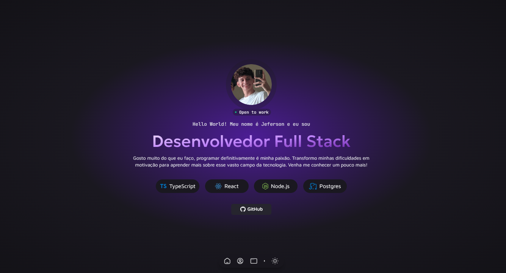

# 📃 Meu Porftfólio

 
 <b> Bem vindo ao meu portfólio, abaixo veja algumas informações sobre ele, como linguagens que foram utilizadas durante a construção dele e o link para o acessar. </b>

## 📌 Indice

- [UI](#UI)
- [Link Utilizado](#Como-rodar)
- [Tecnologias utilizadas](#Tecnologias-utilizadas)
- [Autor](#Autor)

## 💻 UI

    
    

 

## 🎈 Link

<a href="https://jefoli.dev.com"> Ir para o site </a>

## 👨‍💻 Tecnologias utilizadas

## Autor

 
 
 <b> Jeferson Franco, Desenvolvedor Full Stack </b> 
 
 
 

